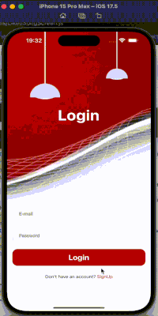

# oneLogin - React Native App

The oneLogin project is a mobile app that allows users to easily log in and sign up. It is developed using React Native and modern tools to provide a seamless experience.

## Features

- Users can fill in the required form fields to log in and create new accounts.
- Animations are used to enrich the user experience.
- A modern and sleek user interface (UI).
- Page navigation is managed using `react-navigation`.
- Animated transitions are implemented using `react-native-reanimated`.

## Technologies

- **React Native**: JavaScript framework for building mobile apps.
- **React Navigation**: Library for managing navigation.
- **React Native Reanimated**: Library for animations.
- **Tailwind CSS (Classnames)**: Used for responsive and easy styling.

## Installation

Follow these steps to run the project on your local machine:

### Install Dependencies

Navigate to the project folder and run the following command in your terminal:

```bash
npm install
Or, if you prefer to use Yarn:

bash
Kodu kopyala
yarn install
Run the App
To start the app, use the following command:

For iOS:

bash
Kodu kopyala
npx react-native run-ios
For Android:

bash
Kodu kopyala
npx react-native run-android
Project Structure
The folder structure of the project is as follows:

bash
Kodu kopyala
oneLogin/
├── assets/                  # App assets (images, etc.)
├── src/
│   ├── components/           # React components
│   ├── navigation/           # Navigation files
│   ├── screens/              # Screen components (Login, SignUp, etc.)
│   └── utils/                # Utility functions
├── App.js                    # Entry point of the app
├── app.json                  # App configuration file
└── package.json              # Dependencies and project configuration
Screens
LoginScreen: User login screen.
SignUpScreen: User sign-up screen.
Contributing
If you would like to contribute to this project:

Fork the repository.
Create a new branch for your feature or fix.
Commit and push your changes.
Open a pull request.


```


